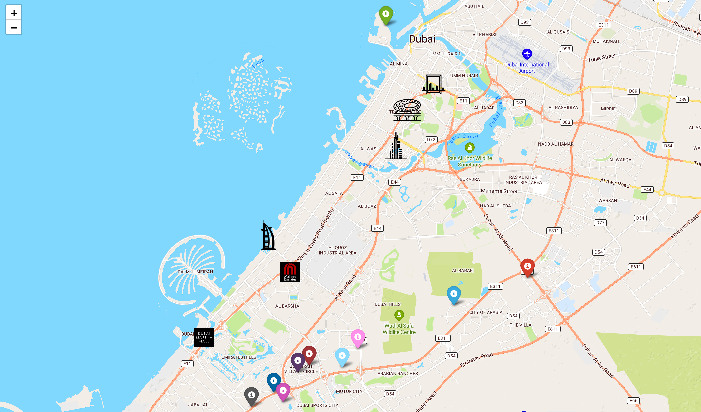

# Interactive Dubai Real Estate Map

## Project Overview
This interactive map showcases the buildings managed by a specific real estate company in Dubai. Utilizing Python and the Folium library, this project provides an intuitive visual representation of the company's property locations throughout the city.



## Features
- Interactive markers representing each building.
- Integration with the Jawg Maps API for up-to-date mapping.
- User-friendly interface with zoom and pan functions.

## Prerequisites
To use this interactive map, you will need to:
1. Register an account at [Jawg.io](https://jawg.io) to obtain an API token.
2. Ensure Python is installed on your system.
3. Install the required Python libraries:

```bash
pip install folium PyQt5 QtWebEngineWidgets
```
## Usage
To run the interactive map, execute the following command:
```bash
python GeoDubai.py
```
